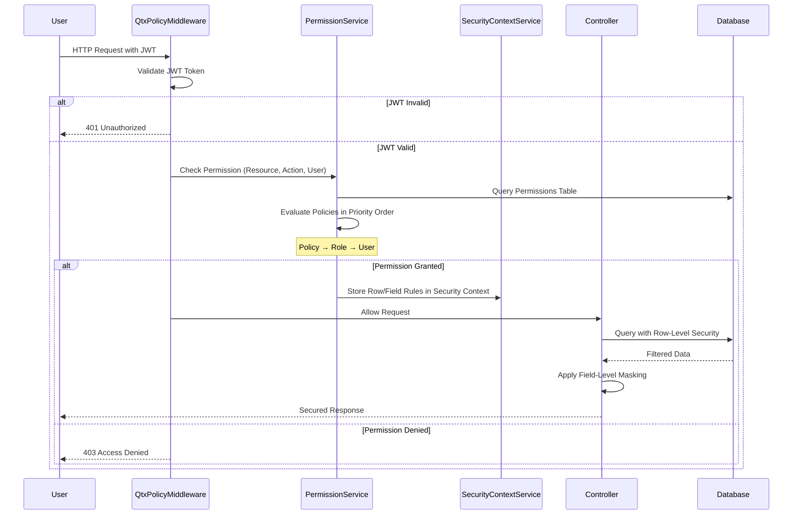

# PolicyPOC

PolicyPOC is a .NET 10 proof-of-concept that demonstrates dynamic, policy-driven authorization for lending data. It combines ASP.NET Core Web APIs, ASP.NET Identity + JWT, Entity Framework Core (SQLite), and a no-build Bootstrap/HTMX front-end served from `wwwroot`.

---

## Architecture at a Glance

| Layer | Highlights |
| --- | --- |
| Hosting | `Program.cs` wires Identity, JWT bearer auth, controllers, static files, and the custom `QtxPolicyMiddleware`. |
| Data | `ApplicationDbContext` targets SQLite (`policy.db`) and tracks `Loans`, `Resources`, `Fields`, `Policies`, and the unified `Permissions` table. |
| Authorization | `[Policy]` attribute tags controller actions. Middleware + `PermissionService` evaluate policies in priority order (Policy → Role → User) and emit row/field rules. |
| Security Context | `SecurityContextService` stores row-level filters and field rules. `Extensions/SecurityContextExtensions` apply them when querying or shaping DTOs. |
| UI | Static Bootstrap/HTMX/Alpine pages under `wwwroot` consume the APIs directly (login, register, resources, policies, permissions, loans, etc.). |

---

## Prerequisites

- [.NET SDK 10.0.* preview](https://dotnet.microsoft.com/en-us/download/dotnet)
- SQLite 3 (bundled with .NET on macOS/Linux; no manual install needed)

---

## Getting Started

1. **Clone & Restore**
   ```bash
   git clone <repo-url>
   cd PolicyPOC
   dotnet restore
   ```

2. **Configure Settings**
   - Copy `appsettings.json` → `appsettings.Development.json` (already present) and tweak:
     - `ConnectionStrings:DefaultConnection` if using a different DB.
     - `Jwt:SigningKey`, `Issuer`, `Audience` for your environment.
     - `Identity:DefaultAdmin` and `Identity:TestUsers` for persona seeds.

3. **Migrate / Seed**
   - Startup automatically runs `IdentitySeeder.EnsureDatabaseAsync`, but you can pre-create the DB:
     ```bash
     dotnet ef database update
     ```

4. **Run**
   ```bash
   dotnet run
   ```
   - APIs: `https://localhost:<port>/api/...`
   - Static UI: `https://localhost:<port>/`

---

## Default Accounts

| Email | Password | Roles |
| --- | --- | --- |
| `admin@local` | `P@ssword123!` | `SuperAdmin` |
| `loanofficer@local` | `P@ssword123!` | `Loan Officer` |
| `underwriter@local` | `P@ssword123!` | `Underwriter` |
| `lenderadmin@local` | `P@ssword123!` | `Lender Admin` |
| `lenderuser@local` | `P@ssword123!` | `Lender User` |
| `auditor@local` | `P@ssword123!` | `Auditor` |
| `borrower@local` | `P@ssword123!` | `Borrower` |

Update `Identity:TestUsers` to add/remove personas or change their departments.

---

## Using the Admin UI

The static UI lives in `wwwroot` and is purposely simple to showcase the APIs without extra tooling.

1. **Login**
   - Browse to `/login.html`.
   - Sign in with one of the seeded accounts. The JWT is stored in `localStorage` (handled by `wwwroot/js/shared.js`).
   - The navbar (loaded via HTMX) updates based on auth state.

2. **Configure Roles & Users**
   - Use `/roles.html` and `/users.html` to view role membership. These pages call `api/roles` and `api/users` (ensure the logged-in account has the required `[Policy]` grants).
   - To register fresh users, hit `/register.html` or use `POST /api/auth/register`. They’ll receive the default role defined in `Identity:DefaultRegisterRole`.

3. **Manage Resources & Fields**
   - `/resources.html` lists logical resources (e.g., `Loan`). Each resource can have child fields with optional `MaskFormat`.
   - `MaskFormat` determines what a user sees when they fail field-level checks (`***-**-{last4}`, empty string for blanking, etc.).

4. **Define Policies**
   - `/policies.html` lets you author JSON policies that evaluate `user.*` and `resource.*` expressions (parsed by `PolicyRuleConverter`).
   - Policies can add row-level rules (e.g., `resource.Department = ${user.Department}`) that the middleware stores in the security context.

5. **Assign Permissions**
   - `/permissions.html` ties policies/roles/users to resources or specific fields for an action (`read`, `write`, etc.).
   - The unified `Permissions` table enforces priority: policy matches first, then roles, then direct users.

6. **Test with Loans**
   - `/loans.html` calls `GET /api/loans`, which layers row-level filtering (`ApplyRowLevelSecurity`) and field-level masking (`ApplyFieldSecurity`) before returning data.
   - Switch between personas (loan officer, underwriter, auditor) to see how RLS and masking affect results.

Because all pages are static, editing the HTML or JS under `wwwroot` and refreshing the browser is enough to tweak the admin experience.

---

## Security Flow (How Authorization Works)

1. Controllers annotate actions with `[Policy("ResourceName", "Action")]`.
2. `QtxPolicyMiddleware` intercepts the request, ensures JWT auth, and invokes `PermissionService`.
3. `PermissionService` loads matching `Permission` rows and evaluates them in priority order:
   - **Policy subjects** deserialize `PolicyRule` JSON and evaluate dynamic expressions, optionally adding row-level filters (`RowLevelSecurityRule`) to the security context.
   - **Role/User subjects** perform direct grants.
4. If granted, row-level filters and field-access rules persist in `SecurityContextService`.
5. Controllers query via `query.ApplyRowLevelSecurity(...)` and mask DTOs via `dto.ApplyFieldSecurity(...)`.
6. If nothing matches, the middleware returns `403 Access denied`.

---

## Authorization Flow Diagram



---

## Future Enhancement: Bulk Field Permission Configuration

> **Status**: Design phase - not yet implemented

When a resource has hundreds or thousands of columns, configuring field-level permissions individually becomes impractical.

### Requirements

Allow configuring field-level permissions using:

| Selector Type | Description | Example |
|---------------|-------------|---------|
| `pattern` | Glob wildcard matching | `PII_*`, `*_encrypted`, `*_secret` |
| `regex` | Regular expression | `^(SSN\|TaxId\|DOB).*` |
| `prefix` | Fields starting with | `internal_` |
| `suffix` | Fields ending with | `_hash` |
| `in` | Include specific fields only | `SSN,DOB,TaxId` |
| `notIn` | Exclude specific fields (all others included) | `SSN,DOB,InternalNotes` |

### Challenges

1. **Runtime Performance** - Evaluating patterns at request time is O(fields × permissions × pattern_complexity). Not scalable for thousands of columns.

2. **UI Display** - If patterns are expanded to individual rows for fast runtime lookup, how do we display the original pattern/intent back to the admin?

3. **Re-expansion** - When fields are added/removed from a resource, should existing `notIn` patterns auto-update to include new fields?

4. **Conflict Resolution** - How to handle multiple patterns that match the same field with different subjects or access levels?

5. **Storage Trade-off** - Pre-expanding patterns means potentially thousands of Permission rows per configuration.

---